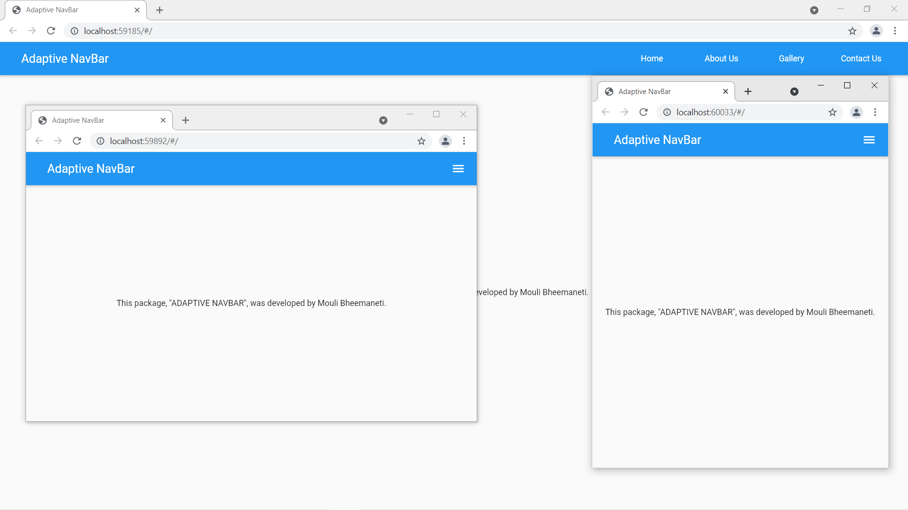

# Adaptive NavBar (adaptive_navbar)

[](https://github.com/moulibheemaneti/adaptive_navbar/issues)
[](https://github.com/moulibheemaneti/adaptive_navbar/network)
[](https://github.com/moulibheemaneti/adaptive_navbar/stargazers)
[](https://github.com/moulibheemaneti/adaptive_navbar/blob/master/LICENSE)



## Table of contents
* [General info](#general-info)
* [Setup](#setup)
* [Conclusion](#conclusion)
* [Useful Resources](#useful-resources)
* [Meet the developer](#meet-the-developer)

## General info
**adaptive_navbar** is a third party flutter package. This is adaptive navbar. This can be easily added to your flutter projects. This make your works simpler and your code shorter. This is recently updated and has null safety too. 
	
## Setup
These are the steps on how to use this package.

#### Run this command:

```
$ flutter pub add adaptive_navbar
```

This will add a line like this to your package's pubspec.yaml (and run an implicit flutter pub get):
```yaml
dependencies:
  adaptive_navbar: ^0.0.1 #check for latest in versions at https://pub.dev/packages/adaptive_navbar/versions
```
Alternatively, your editor might support or flutter pub get. Check the docs for your editor to learn more.

#### Import it
Now in your Dart code, you can use:
```dart
import 'package:adaptive_navbar/adaptive_navbar.dart';
```

## Conclusion
This is not the last package from this developer. Maybe this solely can't be updated frequently but still it is worth using this package. This helps to reduce your code lines.

## Useful Resources
* [Adaptive Navbar Example](https://pub.dev/packages/adaptive_navbar/example)
* [Adaptive Navbar Installing Guide](https://pub.dev/packages/adaptive_navbar/install)
* [Adaptive Navbar Release Notes](https://pub.dev/packages/adaptive_navbar/changelog)
* [Adaptive Navbar Blog](https://medium.com/@moulibheemaneti/adaptive-navbar-in-flutter-by-mouli-bheemaneti-46e16b62c400)

## Meet the developer
**Mouli Bheemaneti** is the developer behind this [adaptive_navbar](https://pub.dev/packages/adaptive_navbar) package. I'm ambitious and driven towards developing new apps and packages.
* [Mouli Bheemaneti](https://www.moulibheemaneti.com)
	* [Play Store](https://play.google.com/store/apps/dev?id=5025838786028729109)
	* [Github](https://www.github.com/moulibheemaneti)
	* [Behance](https://www.behance.com/moulibheemaneti)
	* [Instagram](https://www.instagram.com/mouli.bheemaneti)
	* [Youtube](https://www.youtube.com/bemouli)

## Other packages by this developer
* [MB Button](https://pub.dev/packages/mb_button)
* [MB ContactForm](https://pub.dev/packages/mb_contact_form)
